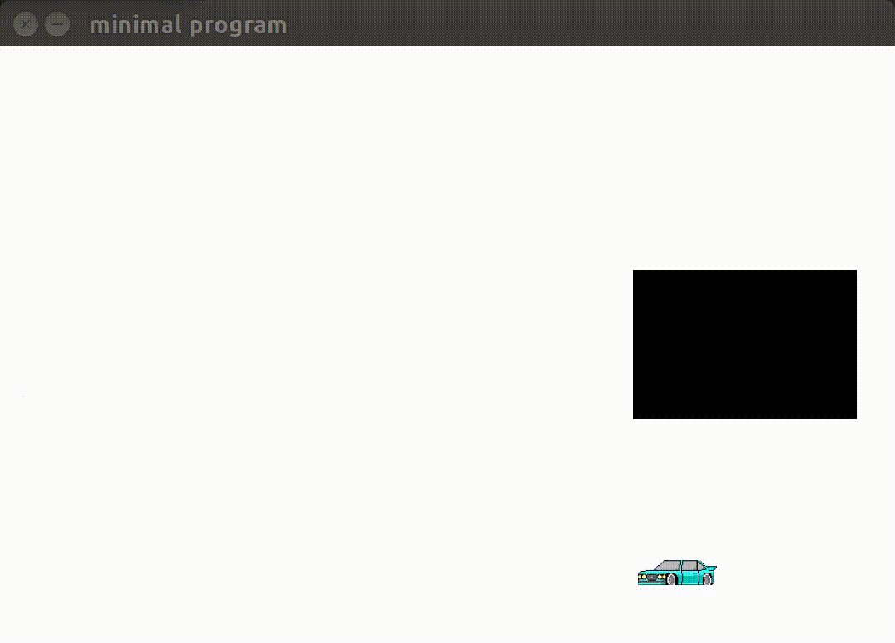

# Keras Car Avoid

Fun example of the car learning some moves early in the training process.


## What is this?
As a fun project in reinforcement learning, I decided to take a cool pixel car I found and make it smart enough to avoid oncoming obstacles. To do this I made a rough version of an openai gym type environment with pygame and set to work modifying a Keras DQN reinforcement learning example to fit the task. 

## Why make this project?
While I normally deal with the computer vision side of machine learning, I have always been facinated with the tradition idea of "AI". A smart autonomous type system that can be trained to perform tasks that we don't want to do. Thus this project was born.

## Requirements:
- TensorFlow=1.14 
- Keras 
- PyGame
- numpy 


## How to use:

#Training it yourself and watching it learn:

- Go ahead and clone this repo, and run the Test_pygame_train.py program.

```
python3 Test_pygame_train.py
```

Now sit back and watch it learn!


## What each py file does:
- Test_pygame_train.py: Interfaces with our simulation and trains the model based on the output provided.

- pygame_sim.py: Our simulation! Takes our car and gives it some character in the form of movement, mock sensor input, rewards and some nice obstacles to avoid.

